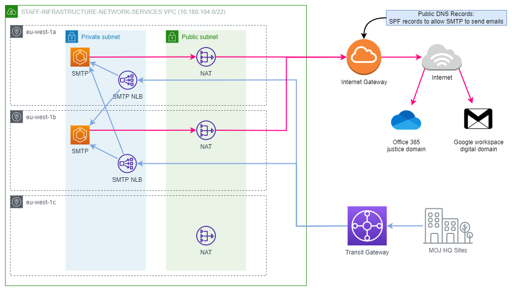

[](https://operations-engineering-reports.cloud-platform.service.justice.gov.uk/public-github-repositories.html#staff-infrastructure-smtp-relay-server "Link to report")

# Staff Infrastructure SMTP Relay Server  

## Introduction  

This repository builds the docker image for the SMTP Relay Server and pushes it to the Shared Services Elastic Container Repository, so that the pre-configured ECS task can pull down this image and launch a new container. 

This repository depends on the network services infrastructure repository, which builds the underlying base infrastructure with required ECR repository and ECS service definitions to work with this docker image.


## Documentation:

- [SMTP Relay Server](#smtp-relay-server)
- [High Level Architecture](#high-level-architecture)
- [Related Repositories ](#related-repositories)
- [Technical Guide](#technical-guide)
- [SMTP Relay Disaster Recovery](#smtp-relay-disaster-recovery)


## SMTP Relay Server

The SMTP Relay Server enables devices which are unable to use authentication to use unauthenticated SMTP to send email.

Currently, printers and a few legacy applications from various MoJ HQ sites are using this SMTP relay service via the Transit Gateway to send emails to both justice and digital domains.

## High Level Architecture

This service consists of an AWS ECS cluster running two instances of SMTP Relay Server containers with postfix image in two availibilty zones in London region. Two load balancers from those two availibility zones are there to accept incoming requests from clients via the Transit gateway and then to distribute the requests to those SMTP Relay Server containers. This provides high availibility and resiliency to the service.

Here is a diagram:

  
[Diagram source](diagrams/staff-infrastructure-network-services-architecture.drawio)


## Related Repositories  

This repository builds the docker image for SMTP Relay server only. Here are some of the other related repositories:  

- [staff-device-shared-services-infrastructure](https://github.com/ministryofjustice/staff-device-shared-services-infrastructure)  
- [staff-infrastructure-network-services](https://github.com/ministryofjustice/staff-infrastructure-network-services)

## Technical Guide  

Once you have deployed the infrastructure, you may use this guide to build and push the SMTP Relay server image.  

### Prerequisites

To be able to follow this guide, you need to have the following already:  
 
- [System infrastructure deployed](https://github.com/ministryofjustice/staff-infrastructure-network-services/blob/main/documentation/how-to-deploy-the-infrastructure.md)
- [Docker](https://www.docker.com/)
- [AWS Vault](https://github.com/99designs/aws-vault#installing) set up.  
- Access to [Moj AWS SSO](https://moj.awsapps.com/start#/).  
- [jq](https://stedolan.github.io/jq/download/) installed.

| :tada: TIP |  
|:-----|  
| You may configure your AWS Vault to use AWS SSO. A [step-by-step guide](https://ministryofjustice.github.io/cloud-operations/documentation/team-guide/best-practices/use-aws-sso.html#re-configure-aws-vault) can be found in our team documentation site. |  

### Clone SMTP Relay Server Repo

1. Clone the staff-infrastructure-smtp-relay-server repository to a local directory on your machine.

### Prepare the Environment Variables  

The configuration/environment variables for running and building the SMTP Relay Server container for the required environment are automatically populated through utilisation of the generate-env-file.sh script which is executed when using the 'make gen-env' command. With this approach an engineer can see what the values are and where they are stored. This helps to speed up the process in getting the SMTP Relay container deployed locally.

2. Generate `.env` file with the required values for the environment automatically, run:  
```bash
make gen-env
```  


### Authenticate Docker with AWS ECR

The Docker base image is stored in ECR. Prior to building the container you must authenticate Docker to the ECR registry. [Details can be found here](https://docs.aws.amazon.com/AmazonECR/latest/userguide/Registries.html#registry_auth).

If you have [aws-vault](https://github.com/99designs/aws-vault#installing) configured with credentials for shared services, do the following to authenticate:

```bash
make authenticate-docker
```  

### Build the image  

3. To build the image on your local docker, run:  

```shell
make build-dev
```  

### Run the server locally  

4. To run the SMTP Relay server on your local docker, run:  

```shell
make run
```

### Test locally  

5. To test the build locally, run:  

```shell
make test
```  

### Push your docker image  

6. To push the built image on to your isolated ECR repository, run:  

```shell  
make publish  
```  

### Deploy a force remote ECS restart  

```shell
make deploy  
```  

### Stopping Local Environment

Once you have finished using the docker image, to shut down the environment, run:  

```shell  
make stop  
```  

###

# SMTP Relay Disaster Recovery

*In the event of disaster recovery for the SMTP Relay Server it is recommended to roll forward with a fix than to roll back. If a rollback is still required, follow the steps in this guide*

The SMTP service has no persistent data to restore in the event of disaster recovery as it is relaying emails from one destination to another. The configuration for the SMTP Relay Server is stored as parameters in Systems Manager (SSM) Parameter store and set in the various places it is required as defined in the terraform code. As a result the code which is stored in the repositories is all that is needed to bring the service back online.

## Disaster Recovery Prerequisites

- Access to the existing AWS account with [AWS BYOIP](https://docs.aws.amazon.com/AWSEC2/latest/UserGuide/ec2-byoip.html) addresses in order to be able to send on mail to ExchangeOnline/GoogleWorkspace. If this is not possible the new Elastic Public IPs will need to be replaced on `mail-relay.staff.service.justice.gov.uk` PTR records within Route53 else mail delivery will fail.
- If account has lost attachment to transit gateway then `push` access to the [transit gateway repo](https://github.com/ministryofjustice/deployment-tgw).

## Recovering from a disaster
In the event that Grafana has alerted on a disaster scenario, follow the steps below to restore service.

### 1. Restore/Deploy the ECS infrastructure
Deploy the underlying AWS infrastructure required for the SMTP Relay Server by following the [How to deploy the Infrastructure](https://github.com/ministryofjustice/staff-infrastructure-network-services/blob/main/documentation/how-to-deploy-the-infrastructure.md) guide. This documentation covers steps for prerequisites, creating a terraform workspace and standing up the infrastructure. 


### 2. Restore/Deploy the SMTP Relay Server
Once Step 1 is complete and the underlying AWS infrastructure is deployed proceed to restoring the SMTP Relay Server container into ECS Fargate by following the steps of this README's [Technical Guide](#technical-guide). This guide includes the necessary prerequisite steps and instructions for Building, Running, Testing, Publishing (to ECR) and Deploying/Restoring the SMTP Relay container into ECS. 